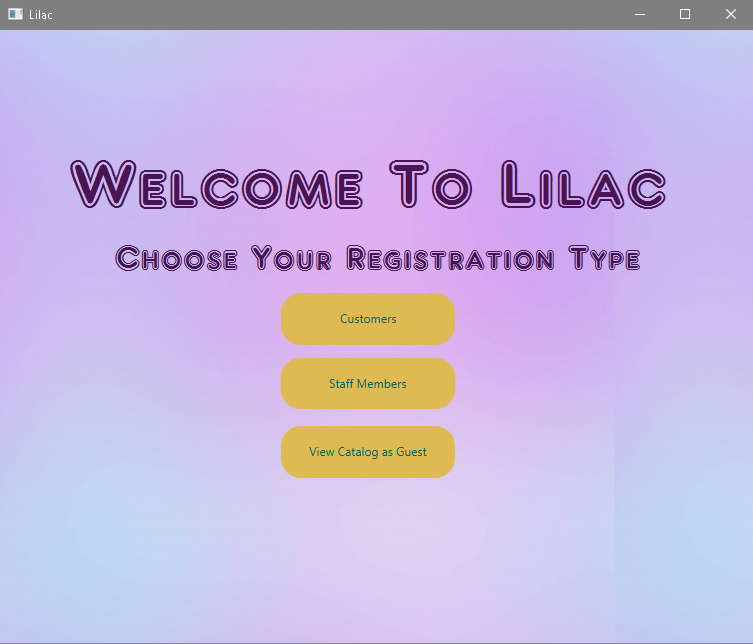
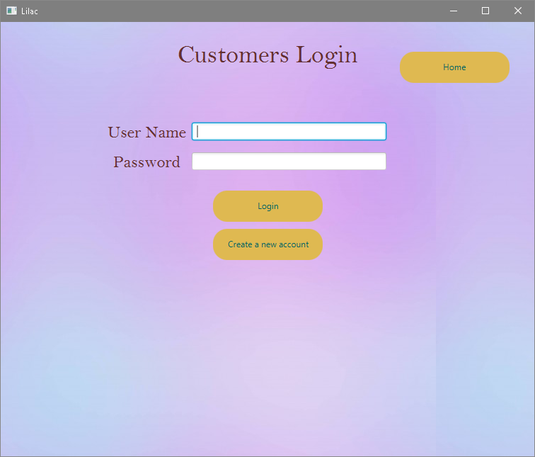
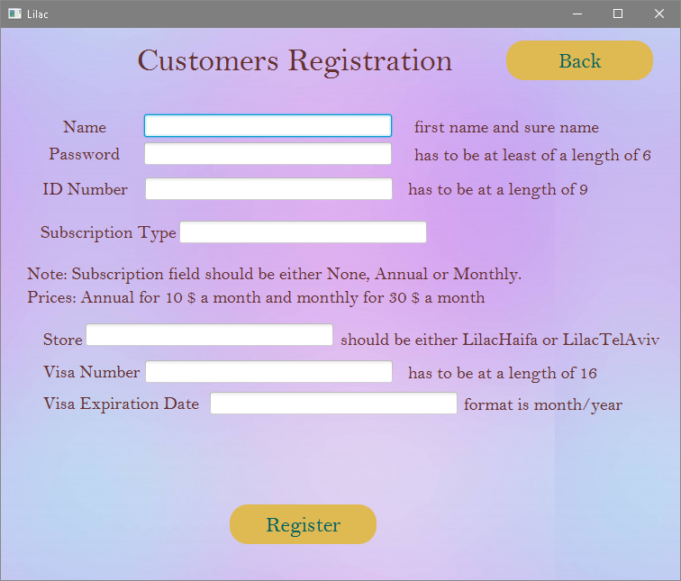
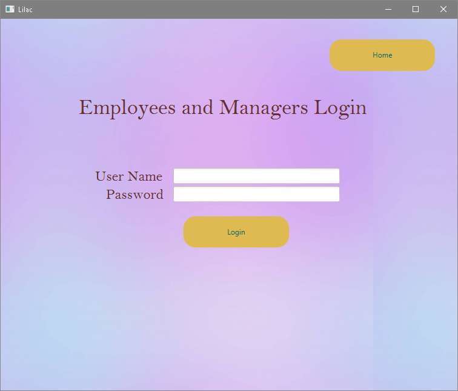
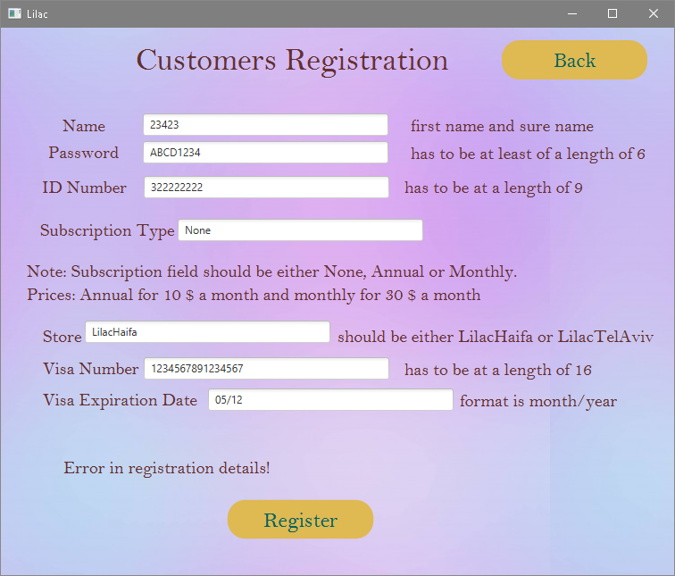

# SWEproject — Lilac Online Flower Store

Full-stack Java desktop application for an online flower shop using a **client–server** architecture (OCSF), **JavaFX** UI, and a remote **MySQL** database.

## What this project does

Lilac is a course software-engineering project that simulates a multi-branch flower store. Users can register or log in as **customers**, **employees**, or **managers**, browse catalog items, build custom products, place orders, and file complaints. Staff can manage catalog entries, sales, and reports; managers get additional reporting and user-management screens.

## Technologies

- Java, JavaFX (FXML)
- OCSF client/server framework (`src/ocsf/`)
- MySQL (JDBC)
- Eclipse project layout (`.project`, `.classpath`)

## Features

- Customer registration, login, cart, checkout, cancellations, complaints
- Employee catalog management, sales, complaints handling
- Manager reports (orders, earnings, complaints), freeze customer, staff registration
- Custom flower / bouquet builder
- Server-side order and catalog logic in `LilacServer.java`

## Project structure

```
SWEproject/
├── Images/                 # README screenshots
├── lib/                    # Place mysql-connector-j.jar here (see lib/README.md)
├── scripts/                # Optional PowerShell run helpers
├── src/
│   ├── application/        # JavaFX FXML + controllers (UI)
│   ├── LilacClasses/       # Domain models (Order, Product, Customer, …)
│   ├── ocsf/               # Client/server + LilacServer (main server logic)
│   ├── catalog/            # Product images
│   └── background/         # UI assets
├── .classpath
├── .project
└── README.md
```

## Prerequisites

- **JDK 11–17** with **JavaFX** on the module path (OpenJDK does not bundle JavaFX)
- **Eclipse IDE** (recommended) or another Java IDE that supports JavaFX
- **MySQL** database reachable from the machine running the server
- **MySQL Connector/J** JAR in `lib/mysql-connector-j.jar`

## Installation

1. Clone the repository:

   ```bash
   git clone https://github.com/Mustafa-Waked/SWEproject.git
   cd SWEproject
   ```

2. Download [MySQL Connector/J](https://dev.mysql.com/downloads/connector/j/) and save the JAR as `lib/mysql-connector-j.jar`.

3. Install a **JavaFX SDK** matching your JDK (e.g. from [Gluon](https://gluonhq.com/products/javafx/)) and configure it in Eclipse as a user library named `JavaFX12`, or set `JAVAFX_SDK` to the SDK `lib` folder when using the scripts.

4. Import the project in Eclipse: **File → Import → Existing Projects into Workspace**.

## Build

1. Open the project in Eclipse.
2. Ensure `lib/mysql-connector-j.jar` exists and JavaFX is on the classpath (see `.classpath`).
3. **Project → Build Project** (output goes to `bin/`).

There is no Maven/Gradle build — this is an Eclipse course project.

## Run

### 1. Configure the database

Update connection settings in `src/ocsf/LilacServer.java` (`DB_URL`, `USER`, `PASS`) for your MySQL instance. The values in the repo are from the original course deployment.

### 2. Start the server

Run `ocsf.LilacServer` (listens on port **5555**).

In Eclipse: right-click `LilacServer.java` → **Run As → Java Application**.

Or from PowerShell (after Eclipse build):

```powershell
.\scripts\run-server.ps1
```

### 3. Start the client (JavaFX app)

Run `application.LilacApp` with program arguments:

```text
<loginId> <serverHost>
```

**Example:**

```text
guest localhost
```

In Eclipse: **Run → Run Configurations → Arguments** → Program arguments: `guest localhost`.

Or:

```powershell
.\scripts\run-client.ps1 guest localhost
```

The client connects to the OCSF server on port **5555** (`LilacClient.DEFAULT_PORT`).

## Example workflow

1. Launch `LilacServer` and wait until the server is listening.
2. Launch `LilacApp` with a login id and server host (e.g. `guest localhost`).
3. Use the home screen to enter as customer, employee, manager, or guest.
4. Browse the catalog, add items to the cart, and complete checkout (customer flow).

## Expected output

- **Server:** console messages indicating the server is listening on port 5555.
- **Client:** JavaFX window titled **Lilac** with the home/login screen.

## Screenshots

| Screen | |
|--------|---|
| Home |  |
| Customer login |  |
| Customer registration |  |
| Staff login |  |
| Validation example |  |

## Troubleshooting

| Problem | Likely cause | Fix |
|---------|--------------|-----|
| `Error: Can't setup connection!` on client | Server not running or wrong host/port | Start `LilacServer` first; use `localhost` if local. Client uses port **5555**, not MySQL port 3306. |
| `ClassNotFoundException: com.mysql.jdbc.Driver` | Missing JDBC JAR | Add `lib/mysql-connector-j.jar` and rebuild. |
| JavaFX / `JavaFX runtime components are missing` | JavaFX not on module path | Install JavaFX SDK; configure Eclipse user library or set `JAVAFX_SDK` for scripts. |
| SQLException / connection refused | DB host unreachable or wrong credentials | Update `LilacServer.java` DB settings; ensure MySQL is running and schema exists. |
| `Usage: LilacApp <loginId> <serverHost>` | Missing program arguments | Pass two arguments when starting the client. |
| FXML load errors | Running from wrong working directory | Run from Eclipse or ensure `bin/` contains copied FXML/CSS resources. |

## Notes / limitations

- Requires a working MySQL schema and network access to the configured DB host.
- JavaFX must be available on the runtime classpath (module path on JDK 11+).
- Remote DB credentials in the repo are from the original course deployment — replace before any real use.
- `src/ocsf/` includes third-party OCSF framework files from the course textbook.

## Author

Mustafa Waked — University of Haifa (Software Engineering project)
